# 📄 TalkToPDF

Chat with your PDF documents using a hybrid RAG (Retrieval-Augmented Generation) pipeline powered by LLaMA 3.3 via Groq.

## ✨ Features

- 📂 Upload multiple PDFs at once
- 🔍 **Hybrid retrieval** — semantic search (ChromaDB) + keyword search (BM25)
- 🏆 **Re-ranking** with FlashRank for higher relevance
- 🧠 **Conversation memory** — ask follow-up questions naturally
- 📌 **Source citations** — answers reference the exact PDF page

---

## 🔄 Pipeline



### How it works, step by step

**1. Ingestion** — PDFs are parsed page-by-page with `pypdf`. Each page becomes a `Document` with `source` and `page` metadata. Pages are then split into 1000-character chunks with 200-character overlap to preserve context across boundaries.

**2. Embedding** — Each chunk is embedded using `sentence-transformers/all-MiniLM-L6-v2` (runs locally, no API needed) and stored in a ChromaDB vector store.

**3. Hybrid retrieval** — At query time, two retrievers run in parallel:
- **Semantic search** — finds the top 10 most similar chunks by vector cosine similarity (ChromaDB).
- **BM25 keyword search** — finds the top 10 most relevant chunks by term frequency.
- Results are merged by an `EnsembleRetriever` with weights 0.7 (semantic) / 0.3 (BM25).

**4. Re-ranking** — The merged candidate list is re-scored by **FlashRank**, a fast cross-encoder re-ranker, which picks the final top 4 chunks by relevance.

**5. Generation** — The top 4 chunks are formatted into a context block and passed to **LLaMA 3.3 70B** via the Groq API, along with the full conversation history (`InMemoryChatMessageHistory`). The model returns a grounded answer with citations to the source PDF and page numbers.

---

## 🗂 Project Structure

```
talktopdf/
├── app.py           # Streamlit UI and session management
├── chain.py         # LLM + RAG chain with conversation memory
├── retriever.py     # Hybrid retriever (semantic + BM25 + reranker)
├── utils.py         # PDF loading, chunking, and formatting helpers
├── requirements.txt
├── .env.example
└── .gitignore
```

---

## 🚀 Quick Start

**1. Clone the repo**
```bash
git clone https://github.com/your-username/talktopdf.git
cd talktopdf
```

**2. Install dependencies**
```bash
pip install -r requirements.txt
```

**3. Set up environment variables**
```bash
cp .env.example .env
# Edit .env and add your GROQ_API_KEY
```

Get a free API key at [console.groq.com](https://console.groq.com).

**4. Run the app**
```bash
streamlit run app.py
```

Open [http://localhost:8501](http://localhost:8501) in your browser.

---

## 📦 Key Dependencies

| Library | Purpose |
|---|---|
| `streamlit` | Web UI |
| `langchain` | RAG orchestration |
| `chromadb` | Vector store |
| `sentence-transformers` | Local embeddings |
| `rank-bm25` | Keyword retrieval |
| `flashrank` | Cross-encoder re-ranking |
| `langchain-groq` | LLM via Groq API |
